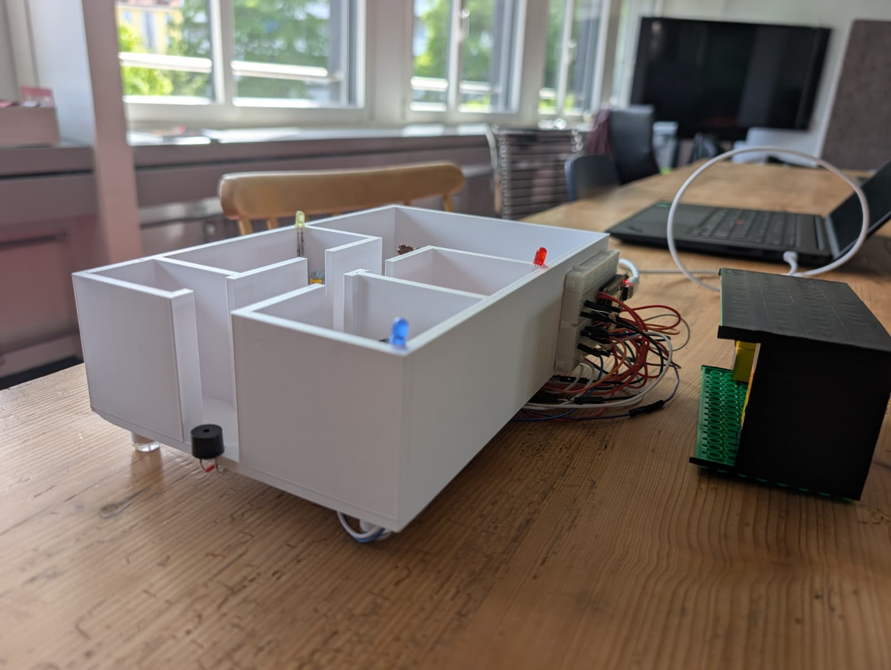
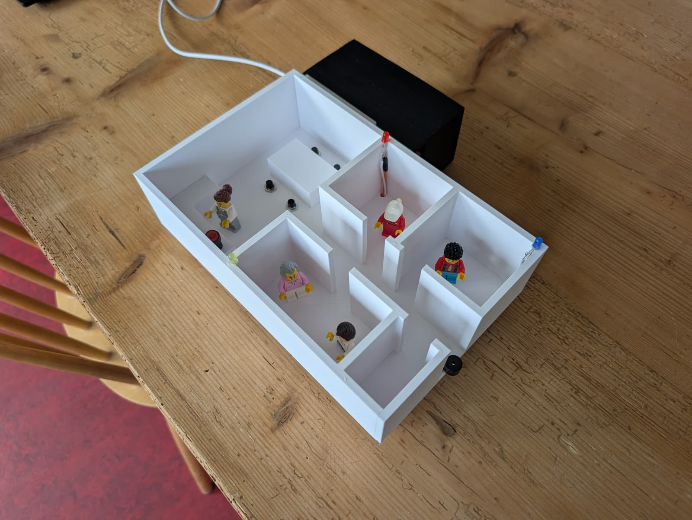
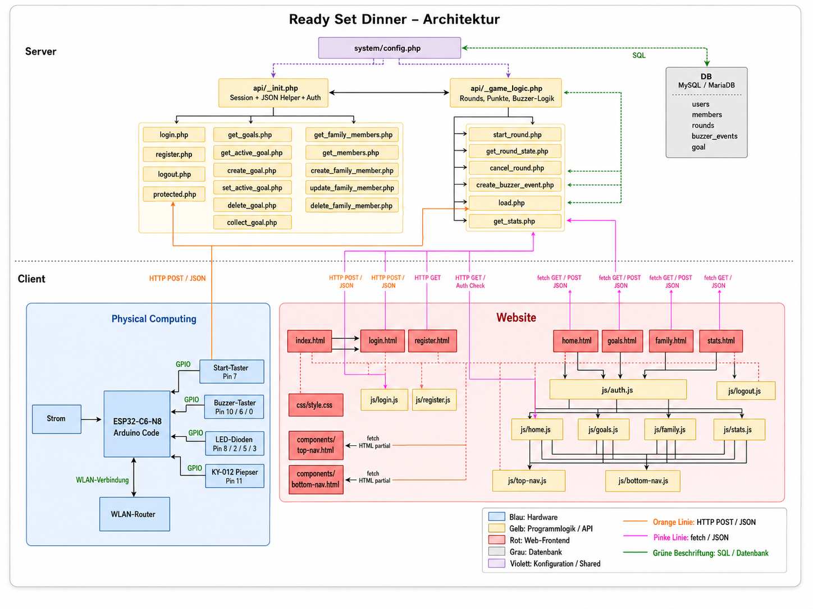
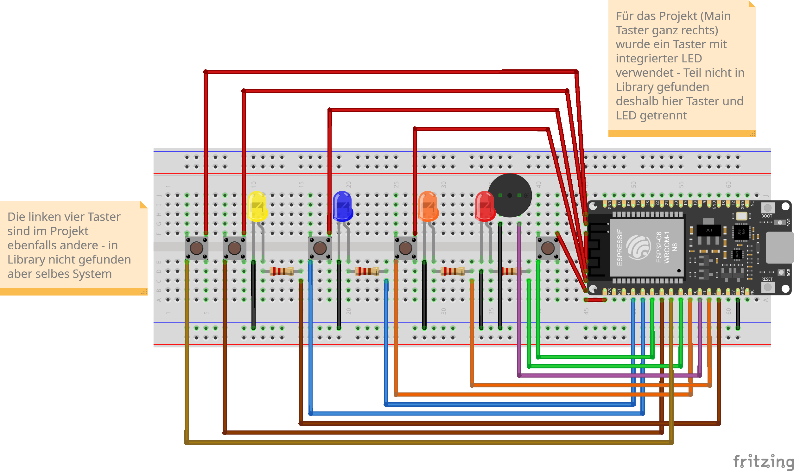
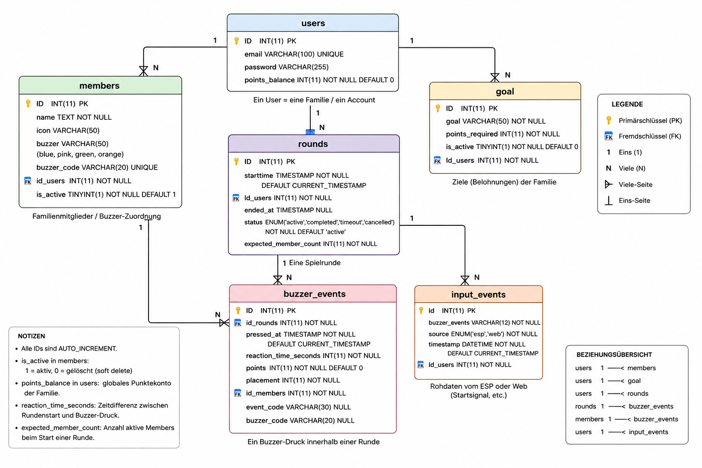

## Ready Set Dinner – Projekt-Dokumentation (IM4)

## Kurzbeschreibung des Projekts
**Ready Set Dinner** ist ein webbasiertes „Dinner-Call“-Spiel: Eine Runde wird gestartet, Family Members drücken ihren Buzzer (Web oder physisch via ESP32), es werden **Reaktionszeiten gemessen** und **Punkte** vergeben. Punkte fliessen in ein **Goal-System** (Ziele sammeln/einlösen) sowie **Statistiken** (Woche/Trend).

* **Modul:** Interaktive Medien 4 an der Fachhochschule Graubünden (FS26)  
* **Themenfeld:** IoT-Applikation zum Thema Eltern mit kleinen Kindern  
* **Name des Projekts:** Ready Set Dinner   
* **Team Physical Computing:** Rebecca Baumberger und Selina Schöpfer 
* **Team WebApp:** Mathis Tobler und Melanie Bürgin
* **Welches Problem im Alltag von Eltern mit kleinen Kindern wird gelöst?**  Die Eltern können durch einen Knopfdruck die Kinder an den Tisch beordern, ohne durch die ganze Wohnung schreien zu müssen oder die Kinder im Haus zusammen zu suchen. Die Eltern profitieren, indem sie ihre Kinder schnell und einfach rufen können. Die Kinder haben davon ein gemeinsames lustiges Erlebnis und die ganze Famile vermeidet unnötigen Streit durch zu spät kommen. 
* **Was ist der „Sinn und Zweck“ des Systems?** Es wird anhand eines gemeinsamen Spiels daran gearbeitet, dass die ganze Familie pünktlich am Esstisch sitzt.


### UX & Konzeption

**UX-Abgabe gemeinsame Schritte (WebApp und Physical Computing)** 
* Absprache der Funktionen und welche Informationen gesammelt werden können vom Physical Computing Team
* Ganzes Team: Erster Entwurf erstellt mit Figma Make
* Review im Team ob die Umsetzung möglich ist
* WebApp Team: Teilweise Anpassungen und vereinfachungen
* WebApp Team: Erstellung von drei möglichen Styles
* Auswahl des Styles im Team
* WebApp Team: erstellen der 3 Style Versionen
* Testen mit Usern
* WebApp Team: Anpassungen und Ausarbeitung des Designs


**Abgaben Links**
* **Figma File:** [Link zum Figma File](https://www.figma.com/design/hP7t6wIKBcyJFWRaTB8l5O/IM-4-%E2%80%93-App-Konzeption_ReadySetDinner?node-id=78-325&t=qRlRDmXuE1G3IGcx-1)
* **Figma Prototyp:** [Link zum Prototyp](https://www.figma.com/proto/hP7t6wIKBcyJFWRaTB8l5O/IM-4-%E2%80%93-App-Konzeption_ReadySetDinner?node-id=40000181-87&p=f&viewport=943%2C-666%2C0.22&t=swagsM9NcMdZJ2Q2-1&scaling=scale-down&content-scaling=fixed&starting-point-node-id=40000181%3A87&show-proto-sidebar=1&page-id=78%3A322)


**User Flow** (Screenshot aus Figma)


**Screen Flow** (Screenshot aus Figma)


**Welche Features waren angedacht?**

login.html/ registrieren.html:
* Konto erstellen: Registrieren
* Login und Logout

home.html:
* ⁠Run starten
* ⁠Einzelne Buzzer in der App drücken
* ⁠Punkte werden live zu goals hinzugezählt
* ⁠Run reset [*Punkte werden dann automatisch wieder weggenommen nach 5min wird der Run eingetragen und alle nicht regristrierten wird kein Dinner call in doe stats geschrieben, den anderen schon*\]

goals.html:
* ⁠Goal Punkte collecten (collect Button = Punkte werden abgezogen und neues Hauptziel kann ausgewählt werden)
* ⁠Goals anlegen
* Goals löschen
* Goal als aktives Goal setzen. Wird auf home.html angezeigt. (Übernahme der gesammelten Punkte)

family.html:
* ⁠Bis zu 4 Mitglieder efassen (mit Name, Icon und Farbe)
* ⁠Mitglieder löschen
* Miglieder bearbeiten
* ⁠Family wechseln/ logout 
* ⁠Überblick über gesamt Punktzahl seit erfassung des Mitglieds
* Nachteilsausgleich: Spielern speziefisch einen Nachteilsausgleich zuweisen, wenn beispielsweise ein Altersunterschied zwischen den Kindern besteht oder wenn die Zimmer nicht gleich weit von der Küche entfernt sind ect.

stats.html
* ⁠Überblick über alle Punkte in dieser Woche 
* Die durchschnittliche Punktzahl der letzten Woche pro Mitglied anzeigen lassen
* Archiv der letzten Monate
* Rangverkündigung nach jedem Spiel

**Welche Features wurden nicht umgesetzt? (Warum)**
* Familienmitglieder hinzufügen wurde Begrenzt auf 4 Mitglieder
Nicht umgesetzt weil: Nicht genügend Komponenten im Physical Computing vorhanden waren.

*  Nachteilsausgleich
Nicht umgesetzt weil: Mathematisch wäre es schwierig gewesen eine Formel zu erstllen, welche in jedem Fall anwendbar gewesen wäre.

* Statistik der vergangenen Spiele wurde Begrenzt auf 3 Wochen
Nicht umgesetzt weil: Wir haben uns auf grund der Übersichtlichkeit der App entschieden die Statistik auf 3 Wochen zu begrenzen.

* Archiv der letzten Monate
Nicht umgesetzt weil: Wir haben den Nutzen abgewägt und uns gegen die Idee entschieden.

* Rangverkündigung nach jedem Spiel
Nicht umgesetzt weil: Wir haben uns dagegen entschieden, weil das bedeuten würde, dass die Famile nach jedem Spiel auf ihre Screens schaut. Wir möchten, dass die Familie möglichst wenig Zeit am Screen verbringt.

### Setup

* **WebApp:** [Link zur Redy Set Dinner Website](https://im4.mathis-tobler.ch)  
WICHTIG! Login für Test:
Benutzer: im4@dozenten.ch 
Passwort:12345
* **Video-Dokumentation:** [Link zum Video auf Youtube](https://youtu.be/IIh378IriPY) 

#### Installationsanleitung WebApp

**1. Infrastruktur:**
* Datenbank
* Webhosting und Domain (Bsp. Informaniak oder Hostpoint)
* Visual Studio Code (oder ähnliches Programm) zum Coden und Programmieren
* Arduino (oder ähnliches Programm), um den Code auf den physichen Komponenten (in unserem Fall den esp32-c6-n8) zu laden
* Komponenten Physical Computing: esp32-c6-n8 und unterschiedliche Sensoren/Aktoren (werden später ausführlicher beschrieben)

**2. Datenbank Import:** 
Die Relationale Datenbank wurde in phpMyAdmin erstellt. Die einzelnen Datensäte werden anhand der php Dateien importiert.
Wichtige API-Endpunkte (Übersicht):

Authentification:
- **`POST api/register.php`**: `{ email, password }`
- **`POST api/login.php`**: `{ email, password }`
- **`GET api/logout.php`**
- **`GET api/protected.php`**: Session-Check

Home / Runden:
- **`GET api/get_active_goal.php`**
- **`GET api/get_members.php`**
- **`POST api/start_round.php`**: startet Runde
- **`GET api/get_round_state.php`**: aktive Runde + Events (Polling)
- **`POST api/create_buzzer_event.php`**: `{ member_id }`
- **`POST api/cancel_round.php`**: bricht letzte Runde ab und zieht Punkte wieder ab
- **`POST api/load.php`**: Physical-Computing Ingest (ESP sendet `{ buzzer_events, id_users, timestamp }`)

Goals:
- **`GET api/get_goals.php`**
- **`POST api/create_goal.php`**: `{ goal, points_required }`
- **`POST api/set_active_goal.php`**: `{ goal_id }`
- **`POST api/delete_goal.php`**: `{ goal_id }`
- **`POST api/collect_goal.php`**

Family + Stats:
- **`GET api/get_family_members.php`**
- **`POST api/create_family_member.php`**
- **`POST api/update_family_member.php`**
- **`POST api/delete_family_member.php`**
- **`GET api/get_stats.php`**

Physical Computing (ESP32 / Arduino):
- Sketch: `hardware/esp32/PysicalComputing.ino`
- Sendet Events (z.B. `Start`, `Buzzer_1..4`, `End`) als **HTTP POST JSON** an `api/load.php`.
- Nutzt NTP-Zeit, damit Events serverseitig korrekt zeitlich eingeordnet werden können.

**3. DB-Credentials eintragen** 
* config.php 

**4. Coden/Programmieren der einzelnen Seiten** 

| .html           | .css      | .js           | .php                  |
|-----------------|-----------|---------------|-----------------------|
| index.html      | style.css | auth.js       | load.php              
|                 |           |               | backup_load.php
|                 |           |               | protected.php
|                 |           |               | _init.php
| register.html   |           | register.js   | register.php
| login.html      |           | login.js      | login.php
|                 |           | logout.js     | logout.php
| home.html       |           | home.js       | get_active_goal.php
|                 |           |               | _game_logic.php
|                 |           |               | start_round.php
|                 |           |               | create_buzzer_event.php
|                 |           |               | get_round_state.php
|                 |           |               | cancel_round.php
|                 |           |               | get_family_members.php
| goals.html      |           | goals.js      | set_active_goal.php
|                 |           |               | get_goals.php
|                 |           |               | delete_goal.php
|                 |           |               | collect_goal.php
| family.html     |           | family.js     | create_family_member.php
|                 |           |               | update_family_member.php
|                 |           |               | delete_family_member.php
|                 |           |               | get_members.php
| stats.html      |           | stats.js      | get_stats.php
| bottom-nav.html |           | bottom-nav.js | 
| top-nav.html    |           | top-nav.js    |


## Bauanleitung Physical Computing

### Ziel des Physical Computing Systems

Das Physical-Computing-System bildet die Verbindung zwischen der realen Welt und der Web-App.

Sobald das Essen bereit ist, kann eine Person den Startknopf drücken. Dadurch wird ein Dinner Call ausgelöst. Die Teilnehmenden werden durch Licht- und Tonsignale informiert, dass sie zum Esstisch kommen sollen.

Jede Person besitzt einen eigenen Buzzer. Wer zuerst am Tisch ankommt und seinen Buzzer drückt, erhält die meisten Punkte.

Alle Ereignisse werden automatisch an die Web-App übertragen und dort gespeichert.

---

## Benötigte Komponenten

Für den Nachbau werden folgende Komponenten benötigt:

| Anzahl | Komponente |
|----------|----------|
| 1 | ESP32-C6 |
| 1 | Start-Button mit integrierter LED |
| 4 | Taster (Buzzer) |
| 3 | LEDs |
| 1 | KY-012 Piepser |
| mehrere | Widerstände |
| mehrere | Jumperkabel |
| 1 | Breadboard |
| 1 | USB-Kabel |
| 1 | Computer mit Arduino IDE |

Die genaue Verkabelung ist im Steckplan dokumentiert. 

---

## Fertiger Aufbau

Der folgende Aufbau zeigt das vollständige Physical-Computing-System von Ready Set Dinner.





## Komponentenplan

Der Komponentenplan zeigt die logischen Verbindungen zwischen Hardware, ESP32, Web-App und Datenbank.



## Steckplan

Der Steckplan zeigt die genaue Verkabelung aller Komponenten am ESP32-C6.



## GPIO-Belegung

| Komponente | GPIO |
|------------|------|
| Start Button | GPIO 7 |
| Start LED | GPIO 8 |
| Buzzer 1 | GPIO 10 |
| LED Buzzer 1 | GPIO 2 |
| Buzzer 2 | GPIO 6 |
| LED Buzzer 2 | GPIO 5 |
| Buzzer 3 | GPIO 0 |
| Buzzer 4 | GPIO 1 |
| Gemeinsame LED Buzzer 3 + 4 | GPIO 3 |
| Piepser KY-012 | GPIO 11 |

## Hardware aufbauen

### Start-Button

Der Start-Button dient zum Auslösen einer neuen Runde.

Beim Drücken des Start-Buttons:

- startet die Zeitmessung
- beginnt der Piepser zu piepsen
- leuchten die Status-LEDs auf
- wird ein Start-Ereignis an die Datenbank gesendet

Zusätzlich besitzt der Start-Button eine integrierte LED, welche während einer laufenden Runde aktiv bleibt.

---

### Teilnehmer-Buzzer

Für jede Person existiert ein eigener Buzzer.

Beispiel:

| Person | Farbe |
|----------|----------|
| Person A | Blau |
| Person B | Pink |
| Person C | Grün |
| Person D | Orange |

Wird ein Buzzer gedrückt:

- wird die Reaktionszeit gemessen
- wird der Tastendruck gespeichert
- wird die zugehörige LED ausgeschaltet
- wird das Ereignis an die Datenbank gesendet

Dadurch ist jederzeit sichtbar, welche Personen bereits am Tisch angekommen sind.

---

### LEDs

Die LEDs zeigen den aktuellen Spielstatus an.

Nach dem Start:

- alle LEDs leuchten

Nach einem erfolgreichen Tastendruck:

- die entsprechende LED wird ausgeschaltet

Sobald alle Personen ihren Buzzer gedrückt haben:

- alle LEDs werden ausgeschaltet
- die Runde endet

---

### Piepser

Der KY-012 Piepser dient als akustisches Signal.

Beim Start einer Runde:

- beginnt der Piepser zu piepsen

Der Piepser wird automatisch deaktiviert:

- wenn alle Buzzer gedrückt wurden
- oder nach einer definierten Zeit

Dies verhindert eine dauerhafte Lärmbelastung.

---

## ESP32 programmieren

### Arduino IDE installieren

1. Arduino IDE herunterladen und installieren.
2. ESP32 Board-Paket installieren.
3. ESP32-C6 mit dem Computer verbinden.
4. Das Projekt `PhysicalComputing.ino` öffnen.

---

### WLAN konfigurieren

Im Arduino-Code müssen die Zugangsdaten des WLANs eingetragen werden.

```cpp
const char* ssid = "WLAN_NAME";
const char* pass = "WLAN_PASSWORT";
```

Der ESP32 verbindet sich beim Start automatisch mit dem WLAN.

---

### API-Adresse konfigurieren

Der ESP32 sendet seine Daten an die Web-App.

Dazu muss die URL des Servers eingetragen werden.

```cpp
const char* serverURL = "https://DEINE-DOMAIN/api/load.php";
```

---

### Sketch hochladen

1. ESP32 auswählen.
2. Richtigen COM-Port auswählen.
3. Sketch kompilieren.
4. Sketch auf den ESP32 hochladen.

Nach erfolgreichem Upload startet das System automatisch.

---

## Kommunikation mit der Web-App

Der ESP32 sendet bei jedem Ereignis eine HTTP-POST-Anfrage an die Datei `load.php`.

Folgende Ereignisse werden übertragen:

- Start
- Buzzer_1
- Buzzer_2
- Buzzer_3
- Buzzer_4
- End

Beispiel einer gesendeten Nachricht:

```json
{
  "buzzer_events": "Buzzer_1",
  "timestamp": "2026-05-21 12:30:55",
  "id_users": 12
}
```

Die Datei `load.php` empfängt diese Daten und speichert sie in der Datenbank.

---

## Ablauf einer Spielrunde

### Runde starten

Eine Person drückt den Start-Button.

Folgende Aktionen werden ausgelöst:

- Timer startet
- LEDs werden eingeschaltet
- Piepser wird aktiviert
- Start-Ereignis wird gespeichert

### Teilnehmende reagieren

Die Familienmitglieder laufen zum Esstisch und drücken ihren Buzzer.

Die Web-App berechnet anschliessend:

- Reaktionszeit
- Platzierung
- Punkte

### Runde beenden

Eine Runde endet automatisch wenn:

- alle vier Buzzer gedrückt wurden
- oder das Zeitlimit erreicht wurde

Anschliessend werden alle LEDs und der Piepser deaktiviert.

---

## Fehlerbehebung

Falls das System nicht funktioniert:

1. WLAN-Verbindung prüfen.
2. API-URL kontrollieren.
3. Datenbankverbindung prüfen.
4. Verkabelung anhand des Steckplans kontrollieren.
5. Serielle Ausgabe im Arduino Serial Monitor prüfen.

Bei Software-Problemen kann es hilfreich sein, KI-Tools wie ChatGPT oder GitHub Copilot zur Analyse von Fehlermeldungen und zur Fehlersuche einzusetzen. Während der Entwicklung dieses Projekts wurden solche Werkzeuge ebenfalls unterstützend verwendet.

---

## Technische Details

// Hier sollte das Verständnis ersichtlich sein / Wie stehen die Dateien in Beziehung zueinander, Wie reden Die Dateien miteinander, Wie ist der Weg der Daten

* **Projektstruktur / Code-Struktur:** \
[*Hinweis: Der Code selbst muss im Repository liegen und im Kopfbereich jeder Datei eine kurze Zusammenfassung enthalten.DONE Bitte noch prüfen*\]  

BILD REBECCA anpassen


* **Datenschnittstelle:** [*zwischen WebApp und Physical Computing*\] 
Die Datenschnittstelle liegt in der Datenbank bei buzzer_events oder input_events???

* **ERM:** Im ERM Sieht man wie unsere Datenbankstruktur aufgebaut ist.



* **Authentifizierung:** [*Erklärung*\]

## Known Bugs

* Was funktioniert noch nicht einwandfrei? 
soweit haben wir keine Bugs entdeckt. 

* Was ist uns aufgefallen bei der Entwicklung?  
Ein sinnvoller Aufbau der Datenbank muss anfänglich besprochen werden und dann strikt befolgt.

* Was könnte noch verbessert werden?
Die App könnte noch weiter ausgebaut werden mit den angänglich geplanten Funktionen.

## Umsetzungsprozess

**Reflexion / Erfahrung / Lernfortschritt:** 
*Was haben wir gelernt?*
* Nutzen und austesten von Figma Make
* Umgang und Austausch zwischen WebApp und Physical Computing Team
* Frontend und Backend coden/ programmieren und wie die einzelnen Files zusammenarbeiten
* Repetition html und css


*Würden wir es nochmal genauso machen? Was war gut, was war schlecht?*  
* Das Projekt hat sehr gut funktioniert und wir sind zufrieden mit der Umsetzung.

**Herausforderungen & Lösungen:** [*Verworfene Ansätze, Fehler, Umplanungen*\] 
* Das schwierigste war das Aufsetzen des Projekts, so dass wir alle zusammenarbeiten konnten und immer auf dem aktuellen Stand waren. 
* WebApp: Uns hat die Datenbankstruktur und die Logik in den Javascript Files ab und zu vor herausvorderungen gestellt.
* Unser Wissen betreffend Javascript und php ist noch nicht sehr ausgereift, daher war es anfangs schwierig zu verstehen was der Code macht respektive was die Fehlermeldungen bedeuten und wie wir diese lösen.
* WebApp: Es war schwer eine funktionierende Datenbankstruktur aufzusetzen, die auch für das Physical Computing Team funktioniert. Hauptsächlich weil unserem Teil des Teams das ganze Wissen zu Physical Computing fehlte, da wir in diesem Bereich keine Einführung hatten.


**KI-Einsatz:** *Dokumentation der verwendeten KI-Tools und deren Nutzen (KI ist nicht verboten)*  
* Wir haben mit ChatGPT gearbeitet, um uns beim Coden und bei Fehlermeldungen zu helfen.
* Zum korrigieren des Codes, für Erklärungen oder bei Fehlermeldungen haben wir Copilot verwendet.


**Fazit:**  
* Wir sind sehr zufrieden, wie das Team zusammengearbeitet und sich gegenseitg ausgeholfen hat. Das Endresultat funktioniert so, wie wir es uns vorgestellt haben und kann sich sehen lassen.

